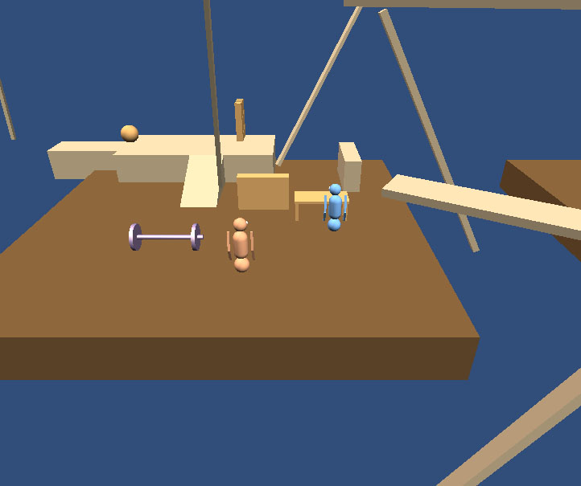
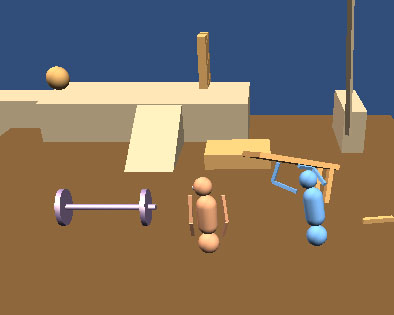
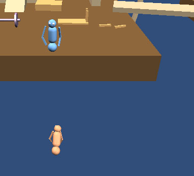
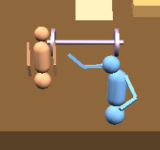
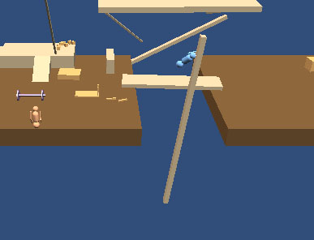

# Grabbing Dolls #

Grabbing Dolls is my attempt to recreate character physics from the GangBeasts fighting game (http://gangbeasts.game/).
In such game characters has no predefined animations in standard sense.
Motion of actors is accomplished via physics-drived inverse kinematics approach:
at every point in time joints of the character receives accurately calculated force values,
and eventually it looks like slightly fuzzy animation,
but in real it's all physical interactions.

### How to play ###
- Open up the project in **Unity Editor**.
- **NOTE:** this project works in Unity 4.7.2f1,
but in Unity 5 and higher it's broken because of the vast changes in PhysX!
It was not upgraded yet,
there are some serious limitations in PhysX 3.
- Open `Sandbox.unity` scene file from the **Project Explorer** window.
- This game is designed to be played with joysticks.
However, it is still playable with keyboard (for 1 player though).

#### Controls ####
| Action              | Joystick   | Keyboard    |
|---------------------|------------|-------------|
| Horz Move           | Left stick | A and D     |
| Vert Move           | Left stick | W and S     |
| Grab or Punch Left  | L1         | O           |
| Grab or Punch Right | R1         | P           |
| Raise               | □          | Right shift |
| Jump                | ☓          | Space       |
| Crouch              | R2         | Left shift  |

### Gameplay ###
First glance:

You'll see two **dolls** on the arena filled with some props and movers.

You can grab props, lift them up and throw!

You can even grab your opponent and throw him out of the arena!

Punching him is also a good strat.

Grab the mover to escape onto another part of the arena.

